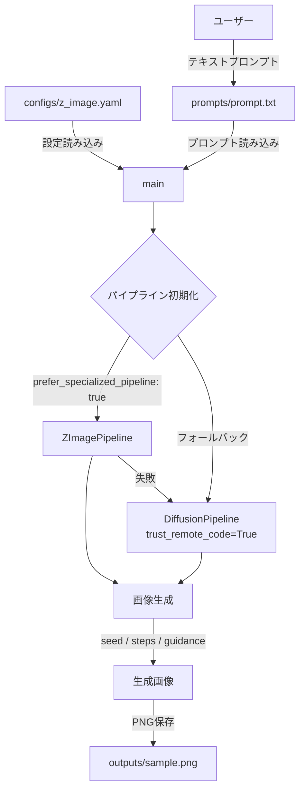
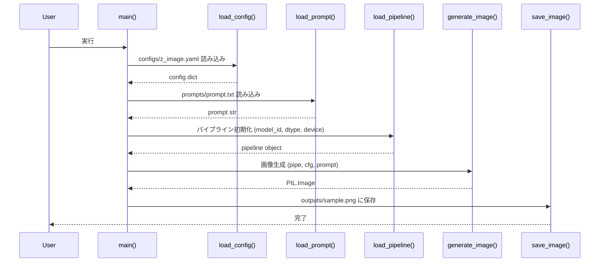
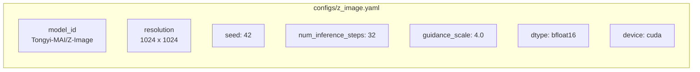

# Z-Image

Hugging Face の拡散モデル（Tongyi-MAI/Z-Image）を使って、テキストプロンプトからアニメ画像を生成するPythonツール。

## 全体アーキテクチャ



## 推論フロー



## 設定パラメータ



## ディレクトリ構成

```
z-image/
├── src/
│   └── inference.py       # 推論メインスクリプト
├── configs/
│   └── z_image.yaml       # モデル・生成パラメータ設定
├── prompts/
│   └── prompt.txt         # 入力テキストプロンプト
├── outputs/               # 生成画像の出力先
└── pyproject.toml         # プロジェクト依存関係
```

## セットアップ

```bash
pip install -e .
```

## 実行

```bash
python src/inference.py
```

生成画像は `outputs/sample.png` に保存されます。

## 主要パラメータ一覧

| パラメータ | デフォルト値 | 説明 |
|---|---|---|
| `model_id` | `Tongyi-MAI/Z-Image` | HuggingFace モデル ID |
| `height` / `width` | `1024` | 出力解像度 (px) |
| `num_inference_steps` | `32` | ノイズ除去ステップ数 (推奨: 28〜50) |
| `guidance_scale` | `4.0` | プロンプト忠実度 (推奨: 3.0〜5.0) |
| `seed` | `42` | 再現性のための乱数シード |
| `device` | `cuda` | 推論デバイス |
| `dtype` | `bfloat16` | 計算精度 (fp16 / bf16 / fp32) |

## 依存ライブラリ

- [diffusers](https://github.com/huggingface/diffusers)
- [transformers](https://github.com/huggingface/transformers)
- [accelerate](https://github.com/huggingface/accelerate)
- [huggingface-hub](https://github.com/huggingface/huggingface_hub)
- [Pillow](https://python-pillow.org/)
- PyTorch (CUDA 対応推奨)
